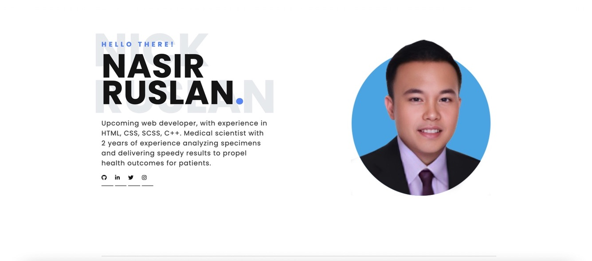
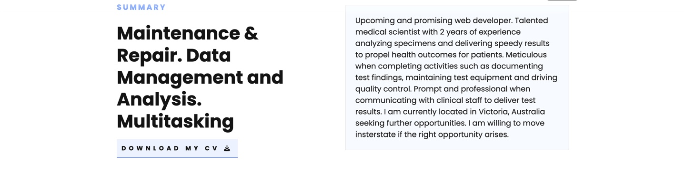
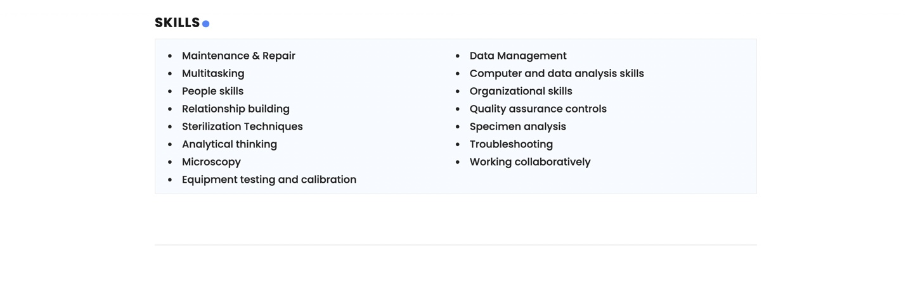
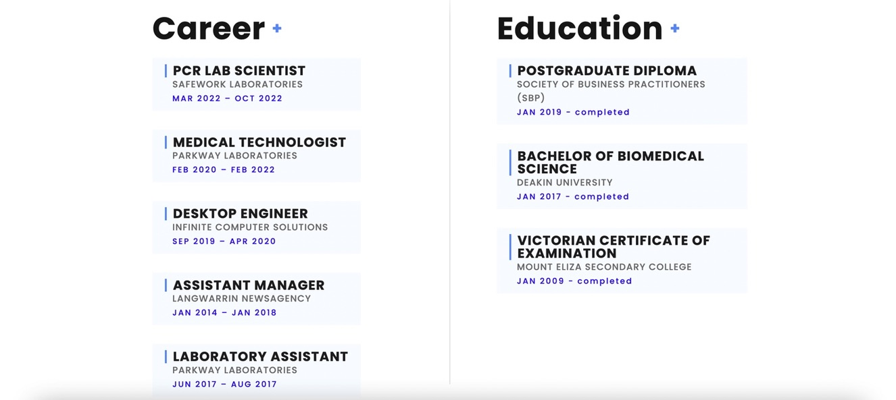
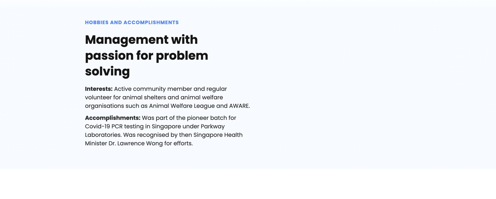
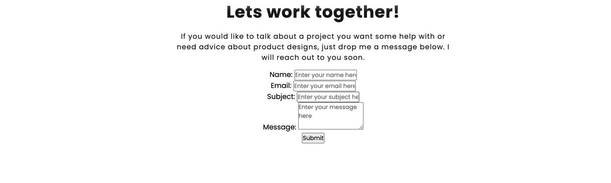
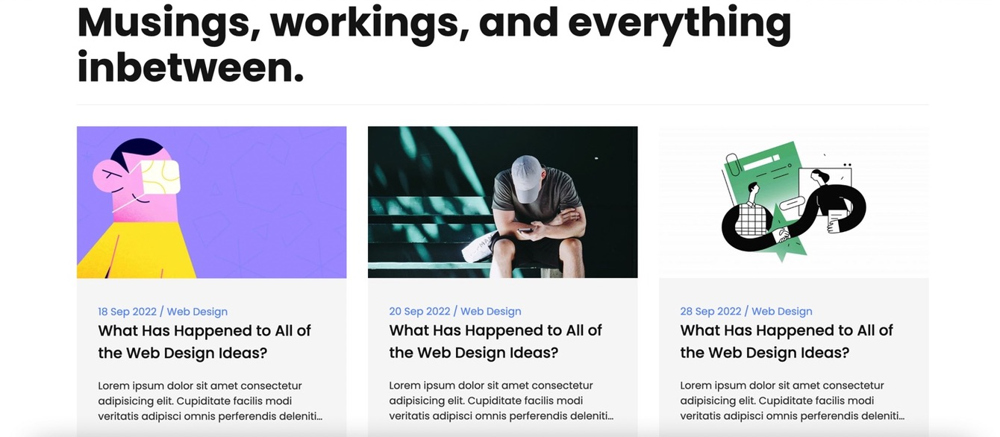
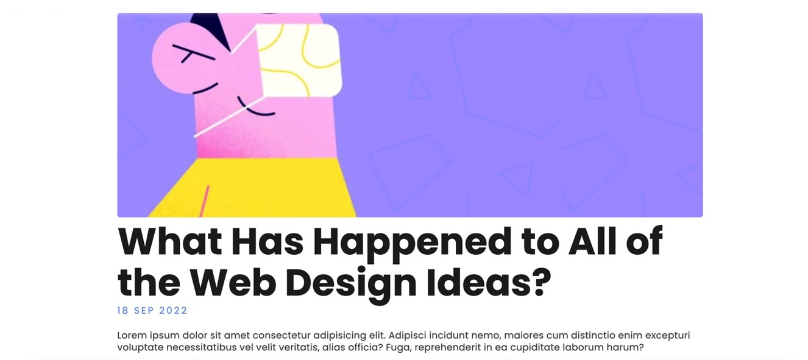
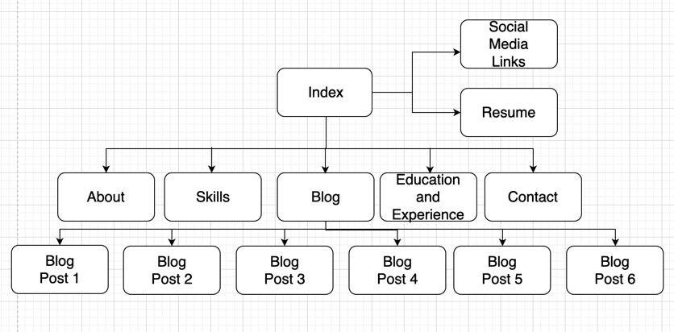

# Folio le Nas - Portfolio
Site URL: portfolio-le-nas.netlify.app
Github Repo URL: https://github.com/eversometiculous/Portfolio_a_Nas


## Overview
This is a portfolio website for displaying information about me. This is a development page and I will keep on adding those features in this readme as I add on to the website. As of right now, the features will include an index page, about page, skills page, experience and education page, blog page that will have 6 blog posts with url links to each, and finally the contact page.

--
##Components

--
### Header
The header and its scss(found in components) has my logo(name) along with the navigation bar. Here is the code for the header:


```html
<header>

     <!--==Navigation==============================-->
    <nav class="navigation">

        <!--logo-->
        <div class="logo-container">
            <a href="../pages/index.html" class="logo">
                
            </a>
            <input type="checkbox" class="menu-btn" id="menu-btn">
            <label for="menu-btn" class="menu-icon">
                <span class="nav-icon"></span>
            </label>
            <!--menu-->
            <ul class="menu">
                <li><a href="../pages/about.html">About</a></li>
                <li><a href="../pages/skills.html">Skills</a></li>
                <li><a href="../pages/experience.html">Experience</a></li>
                <li><a href="../pages/blog.html">Blog</a></li>
                <li><a href="../pages/contact.html" class="nav-contact">Contact</a></li>
            </ul>
        </div>

    </nav>
</header>
```

--
### Footer
The footer and its scss(found in components) has my copyright logo. Here is the code:


```html
<footer>
        <span>Copyright 2023 - NICK RUSLAN</span>

        <a href="../pages/index.html" class="footer-logo">NICK RUSLAN</a>
</footer>
```

--
## Pages

### Index
The index page, or homepage, contains a picture of me, a short summary about me, and my social media links. Here is the code:



```html
<main>
    <section id="main">

        <div class="main-bg">
            
        </div>
        <div class="main-text">
            <strong>Hello there!</strong>
            <h1>NASIR RUSLAN<span>.</span></h1>
            <p>Upcoming web developer, with experience in HTML, CSS, SCSS, C++. Medical scientist with 2 years of experience analyzing specimens and delivering speedy results to
                propel health outcomes for patients.</p>
            <div class="main-social">
                <a href="https://github.com/eversometiculous"  target="_blank"><i class="fa-brands fa-github"></i></a>
                <a href="https://www.linkedin.com/in/nasir-ruslan-9114b1176/"  target="_blank"><i class="fa-brands fa-linkedin-in"></i></a>
                <a href="https://twitter.com/nasisfast"  target="_blank"><i class="fa-brands fa-twitter"></i></a>
                <a href="https://www.instagram.com/nasisfast/"  target="_blank"><i class="fa-brands fa-instagram"></i></a>
            </div>
        </div>

        <div class="main-img">
            
        </div>

    </section>

</main>
```

--
### About
The About page contains a more detailed summary about me as well as a download link to my resume. Here is the code:



```html
<main>
    <!--==About Me(Summary)=========================================-->
   <section id="summery">
    <div class="summery-heading">
        <strong>Summary</strong>
        <h2>Maintenance & Repair. Data Management and Analysis. Multitasking</h2>
        <a href="../cv/Resume_NickRuslan13032023.pdf" download="NICK_RUSLAN_cv">Download my CV <i class="fas fa-download"></i></a>
    </div>

    <div class="summery-details">
        <p>Upcoming and promising web developer. Talented medical scientist with 2 years of experience analyzing specimens and delivering speedy results to
            propel health outcomes for patients. Meticulous when completing activities such as documenting test
            findings, maintaining test equipment and driving quality control. Prompt and professional when
            communicating with clinical staff to deliver test results. I am currently located in Victoria, Australia seeking
            further opportunities. I am willing to move insterstate if the right opportunity arises.
            </p>
            
    </div>

</section>

</main>
```

--
### Skills
The Skills page contains a list of skills(in list form) I have procured during my career. Here is the code:



```html
<main>
       <section id="languages">

        <div class="language-box">

            <h3>SKILLS<span>.</span></h3>


            <ul>
                <li>Maintenance & Repair</li>
                <li>Data Management</li>
                <li>Multitasking</li>
                <li>Computer and data analysis skills</li>
                <li>People skills</li>
                <li>Organizational skills</li>
                <li>Relationship building</li>
                <li>Quality assurance controls</li>
                <li>Sterilization Techniques</li>
                <li>Specimen analysis</li>
                <li>Analytical thinking</li>
                <li>Troubleshooting</li>
                <li>Microscopy</li>
                <li>Working collaboratively</li>
                <li>Equipment testing and calibration</li>
            </ul>
        </div>

    </section>

</main>
```

--
### Experience
The Experience page contains a list of my education and career history as well as some hobbies and accomplishments of mine. Here is the code:





```html
<main>

    <!--==Career===========================-->
    <section id="career-education">

        <div class="career">
        <h3>Career <span>+</span></h3>
        <div class="c-box-container">

            <div class="c-box">
                <h4>PCR Lab Scientist</h4>
                <strong>SafeWork Laboratories</strong>
                <span>MAR 2022 – OCT 2022</span>
            </div>

            <div class="c-box">
                <h4>Medical Technologist</h4>
                <strong>Parkway Laboratories</strong>
                <span>FEB 2020 – FEB 2022</span>
            </div>

             <div class="c-box">
                <h4>Desktop Engineer</h4>
                <strong>Infinite Computer Solutions</strong>
                <span>SEP 2019 – APR 2020</span>
            </div>

             <div class="c-box">
                <h4>Assistant Manager</h4>
                <strong>Langwarrin Newsagency</strong>
                <span>JAN 2014 – JAN 2018</span>
            </div>

             <div class="c-box">
                <h4>Laboratory Assistant</h4>
                <strong>Parkway Laboratories</strong>
                <span>JUN 2017 – AUG 2017</span>
            </div>

        </div>

        </div>


        <!--Education*****************************-->
        <div class="career edu">
            <h3>Education <span>+</span></h3>
            <div class="c-box-container">
    
                <div class="c-box">
                    <h4>Postgraduate Diploma</h4>
                    <strong>Society of Business Practitioners (SBP)</strong>
                    <span>JAN 2019 - completed</span>
                </div>
    
                <div class="c-box">
                    <h4>Bachelor of Biomedical Science</h4>
                    <strong>Deakin University</strong>
                    <span>JAN 2017 - completed</span>
                </div>
    
                <div class="c-box">
                    <h4>Victorian Certificate of Examination</h4>
                    <strong>Mount Eliza Secondary College</strong>
                    <span>JAN 2009 - completed</span>
                </div>

            </div>
    
            </div>


    </section>

        <!--Hobbies-and-Accomplishments*****************************-->

        <section id="about">

            <div class="about-container">
        
                <div class="about-heading">
                    <strong>Hobbies and Accomplishments</strong>
                    <h3>Management with passion for problem solving</h3>
                    
                <div class="about-details" >
                    <p><b>Interests:</b> Active community member and regular volunteer for animal shelters and animal
                        welfare organisations such as Animal Welfare League and AWARE.</p>
                    <p><b>Accomplishments:</b> Was part of the pioneer batch for Covid-19 PCR testing in Singapore under Parkway
                        Laboratories. Was recognised by then Singapore Health Minister Dr. Lawrence Wong
                        for efforts.</p>
                </div>
        
            </div>
        
            </section>

</main>
```

--
### Contact
The Contact page contains information on how to reach me via the button. Here is the code:



```html
<main>
    <!--==main(contact)=====================================-->

    <section id="contact" class="contact">
        <strong>WHATS NEXT</strong>
        <h3>Lets work together!</h3>
        <p>If you would like to talk about a project you want some help with or need advice about product designs, just drop me a message below. I will reach out to you soon.</p>
        <form>
            <div class="form-elements">
                <label>Name: </label>
                <input class="form-input" placeholder="Enter your name here">
            </div>
            <div class="form-elements">
                <label>Email: </label>
                <input class="form-input" placeholder="Enter your email here">
            </div>
            <div class="form-elements">
                <label>Subject: </label>
                <input class="form-input" placeholder="Enter your subject here">
            </div>
            <div class="form-elements">
                <label>Message: </label>
                <textarea
                rows="3"
                class="form-input form-textarea" placeholder="Enter your message here"></textarea>
                </textarea>
            </div>

            <div class="btn-div">
                <button id="submit">Submit</button>
            </div>
        </form>
</main>
```

--
### Blog
The Blog page contains the dates and titles of 6 different blog posts along with a short summary on each of them with pictures. Here is the code:



```html
<main>
    <!--==main(Blogs)=====================================-->

    <section id="blog">


        <div class="blog-heading">
            <h1>Musings, workings, and everything inbetween.</h1>
        </div>


        <div class="blog-container">
      <!--==Blogs 1-6=====================================-->

          <!--==Blog 1 link picture=====================================-->
          <div class="blog-box">
            <div class="blog-img">
              
            </div>

            <!--==Blog 1 link text=====================================-->
            <div class="blog-text">
              <span>18 Sep 2022 / Web Design</span>
              <a href="../pages/post1.html" class="blog-title">What Has Happened to All of the Web Design Ideas?</a>
              <p>Lorem ipsum dolor sit amet consectetur adipisicing elit. Cupiditate facilis modi veritatis adipisci omnis perferendis deleniti tempore quasi? Explicabo recusandae soluta vel cum perspiciatis consequuntur dolorum distinctio minima voluptate quae?</p>
              <a href="../pages/post1.html">Read More</a>
            </div>
          </div>
  
          <!--==Blog 2 link picture=====================================-->
          <div class="blog-box">

            <div class="blog-img">
              
            </div>

            <!--==Blog 2 link text=====================================-->
            <div class="blog-text">
              <span>20 Sep 2022 / Web Design</span>
              <a href="../pages/post2.html" class="blog-title">What Has Happened to All of the Web Design Ideas?</a>
              <p>Lorem ipsum dolor sit amet consectetur adipisicing elit. Cupiditate facilis modi veritatis adipisci omnis perferendis deleniti tempore quasi? Explicabo recusandae soluta vel cum perspiciatis consequuntur dolorum distinctio minima voluptate quae?</p>
              <a href="../pages/post2.html">Read More</a>
            </div>
          </div>
  
          <div class="blog-box">

            <!--==Blog 3 link picture=====================================-->
            <div class="blog-img">
              
            </div>

            <!--==Blog 3 link text=====================================-->
            <div class="blog-text">
              <span>28 Sep 2022 / Web Design</span>
              <a href="../pages/post3.html" class="blog-title">What Has Happened to All of the Web Design Ideas?</a>
              <p>Lorem ipsum dolor sit amet consectetur adipisicing elit. Cupiditate facilis modi veritatis adipisci omnis perferendis deleniti tempore quasi? Explicabo recusandae soluta vel cum perspiciatis consequuntur dolorum distinctio minima voluptate quae?</p>
              <a href="../pages/post3.html">Read More</a>
            </div>
          </div>


          <div class="blog-box">

            <!--==Blog 4 link picture=====================================-->
            <div class="blog-img">
              
            </div>

            <!--==Blog 4 link text=====================================-->
            <div class="blog-text">
              <span>20 Nov 2022 / Web Design</span>
              <a href="../pages/post4.html" class="blog-title">What Has Happened to All of the Web Design Ideas?</a>
              <p>Lorem ipsum dolor sit amet consectetur adipisicing elit. Cupiditate facilis modi veritatis adipisci omnis perferendis deleniti tempore quasi? Explicabo recusandae soluta vel cum perspiciatis consequuntur dolorum distinctio minima voluptate quae?</p>
              <a href="../pages/post4.html">Read More</a>
            </div>
          </div>
  

          <div class="blog-box">

            <!--==Blog 5 link picture=====================================-->
            <div class="blog-img">
              
            </div>

            <!--==Blog 5 link text=====================================-->
            <div class="blog-text">
              <span>13 Nov 2022 / Web Design</span>
              <a href="../pages/post5.html" class="blog-title">What Has Happened to All of the Web Design Ideas?</a>
              <p>Lorem ipsum dolor sit amet consectetur adipisicing elit. Cupiditate facilis modi veritatis adipisci omnis perferendis deleniti tempore quasi? Explicabo recusandae soluta vel cum perspiciatis consequuntur dolorum distinctio minima voluptate quae?</p>
              <a href="../pages/post5.html">Read More</a>
            </div>
          </div>
  

          <div class="blog-box">
  
            <!--==Blog 6 link picture=====================================-->
            <div class="blog-img">
              
            </div>

            <!--==Blog 6 link text=====================================-->
            <div class="blog-text">
              <span>26 Nov 2022 / Web Design</span>
              <a href="../pages/post6.html" class="blog-title">What Has Happened to All of the Web Design Ideas?</a>
              <p>Lorem ipsum dolor sit amet consectetur adipisicing elit. Cupiditate facilis modi veritatis adipisci omnis perferendis deleniti tempore quasi? Explicabo recusandae soluta vel cum perspiciatis consequuntur dolorum distinctio minima voluptate quae?</p>
              <a href="../pages/post6.html">Read More</a>
            </div>
          </div>
  
        </div><

    </section>

</main>
```

--
#### Blog posts 1-6
The blog posts 1-6 titled post1.html up to post6.html contains the title of the blog, the date of the post, a picture for the blog, and text for the blog post itself. Here is the code for Blog post 1(post1.html). The others are similar in coding structure:



```html
<main>

    <!--==post===============================================-->
    <section id="post">
      
      <div class="content-post">
        <h1>What Has Happened to All of the Web Design Ideas?</h1>
        <span>18 Sep 2022</span>
        <p>Lorem ipsum dolor sit amet consectetur adipisicing elit. Adipisci incidunt nemo, maiores cum distinctio enim excepturi voluptate necessitatibus vel velit veritatis, alias officia? Fuga, reprehenderit in ea cupiditate laborum harum?</p>
        <p>Lorem ipsum dolor sit amet consectetur adipisicing elit. Repellendus iste tenetur maiores necessitatibus! Ea quia omnis voluptatibus odio nobis maxime quam tenetur, quis, et, quibusdam fuga molestias blanditiis beatae sapiente! Lorem ipsum dolor sit amet consectetur adipisicing elit. Fuga molestias deleniti sit, assumenda expedita quod reprehenderit dicta, reiciendis nobis ratione architecto perferendis facilis magnam voluptate voluptas itaque enim numquam quisquam?</p>
        <p>Lorem ipsum, dolor sit amet consectetur adipisicing elit. Aspernatur delectus perspiciatis aut? Necessitatibus, obcaecati unde! Vero hic architecto laborum ipsum possimus. Totam distinctio sunt accusamus voluptas fugit. Fugiat, corporis magnam! Lorem ipsum dolor, sit amet consectetur adipisicing elit. Nam dolorem sunt magnam perspiciatis ducimus quae pariatur temporibus, modi aperiam distinctio, fuga optio quo, delectus quaerat accusamus soluta. Id, perferendis aliquam.</p>
      </div>
    </section>

</main>
```

--
## Styling

--
### Components
This will contain the styling of individual components which are as follows:
- Header
- Footer

--
### Defaults
This will contain the styling for variables such as colors, etc.

--
### Pages
This will contain the styling for each individual HTML page.

--
# Target Audience
The target audience is for clients who want to view my portfolio to engage my services as an upcoming web developer or as a medical scientist.

--
# Tech Stack
This was created using HTML, CSS, SCSS and was deployed on Netlify.

--
# Sitemap
This is the sitemap used to create the portfolio website. It can also be found in the folder.



--
# # Portfolio_a_Nas
